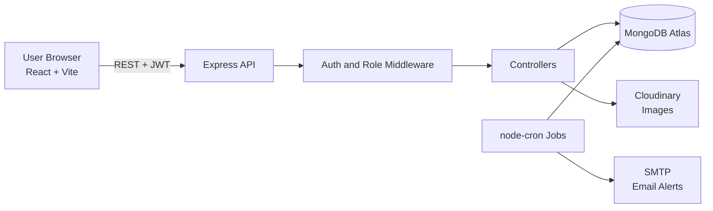
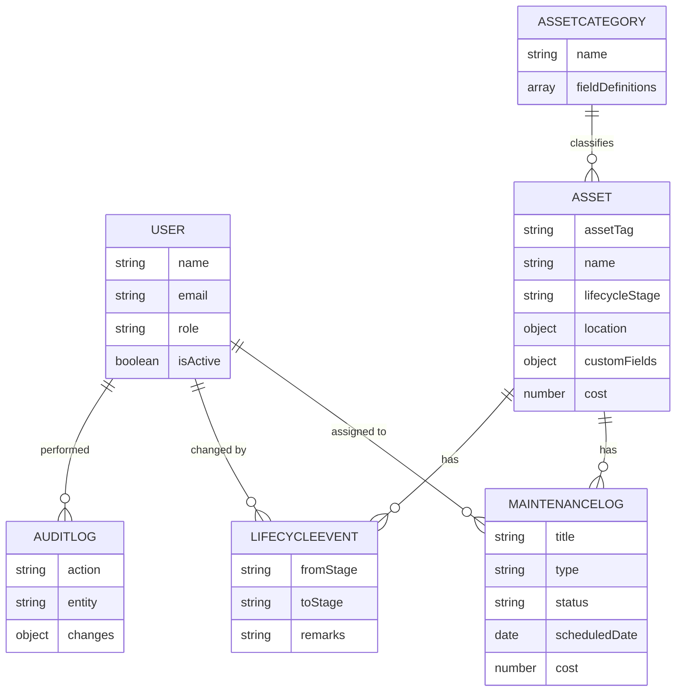

# Infrastructure Asset Inventory

An end-to-end web application to **track and manage infrastructure assets across their entire lifecycle**, from planning and procurement to maintenance and decommissioning.

**Live demo:** `<add-your-vercel-url>`
**API:** `<add-your-render-url>/api/health`

---

## Table of Contents

1. [Problem Statement](#problem-statement)
2. [Solution Overview](#solution-overview)
3. [Features](#features)
4. [Tech Stack](#tech-stack)
5. [Architecture](#architecture)
6. [Data Model](#data-model)
7. [Folder Structure](#folder-structure)
8. [Local Setup](#local-setup)
9. [Environment Variables](#environment-variables)
10. [Demo Credentials](#demo-credentials)
11. [Roles and Permissions](#roles-and-permissions)
12. [API Summary](#api-summary)
13. [Deployment](#deployment)
14. [Troubleshooting](#troubleshooting)
15. [Future Scope](#future-scope)

---

## Problem Statement

> Building an end-to-end infrastructure asset inventory to track and manage assets across their entire lifecycle.

Organizations that own roads, utilities, telecom equipment, buildings, vehicles, and IT hardware often track them in scattered spreadsheets. This leads to missed maintenance, expired warranties, unknown asset conditions, and poor planning.

## Solution Overview

A single system with:

- A central registry of all assets
- A validated lifecycle for every asset
- Maintenance scheduling and tracking
- A dashboard that highlights what needs attention
- QR codes and a map view for field use

## Features

- **Flexible asset categories:** Civil and Public Works, Utilities, Telecom and Network, Building Facilities, Transport, IT Assets. Each category defines its own custom fields, so new asset types need no code changes.
- **Lifecycle tracking:** Planned → Procured → Installed → In Service ⇄ Under Maintenance → Decommissioned, with validated transitions and a full timeline.
- **Maintenance management:** preventive, corrective, and inspection work. Starting maintenance moves the asset to Under Maintenance; completing it returns the asset to In Service.
- **Dashboard and analytics:** counts by category, stage, and status; maintenance cost trends; overdue work; expiring warranties; assets near end of life.
- **QR codes:** generate and print a label per asset; scan to open the asset page.
- **Map view:** all assets on an OpenStreetMap map with clustering and stage-colored markers.
- **Role-based access control:** admin, manager, technician.
- **Audit trail:** who changed what and when.
- **CSV import and export** with a dry-run preview and per-row validation errors.
- **Image upload** through Cloudinary.
- **Alerts:** daily cron job and email digest (optional), plus an in-app notification bell.

## Tech Stack

| Layer | Technology |
|---|---|
| Frontend | React (Vite), Tailwind CSS, React Router, Axios, Recharts |
| Maps | Leaflet, OpenStreetMap, marker clustering |
| QR | `qrcode` (generate), `html5-qrcode` (scan) |
| Backend | Node.js, Express |
| Database | MongoDB Atlas, Mongoose |
| Auth | JWT, bcrypt |
| Security | helmet, cors, express-rate-limit, input validation, mongo-sanitize |
| Uploads | multer, Cloudinary |
| Jobs and email | node-cron, Nodemailer |
| Hosting | Vercel (client), Render (server), MongoDB Atlas (database) |

## Architecture



## Data Model



## Folder Structure

```
asset-inventory/
├── client/
│   ├── src/
│   │   ├── api/           # Axios instance
│   │   ├── components/    # UI components
│   │   ├── context/       # Auth and Toast contexts
│   │   ├── pages/         # Dashboard, Assets, Maintenance, Map, Scan, ...
│   │   └── utils/         # Formatters, constants
│   ├── vercel.json
│   └── .env.example
├── server/
│   ├── src/
│   │   ├── config/
│   │   ├── models/
│   │   ├── controllers/
│   │   ├── routes/
│   │   ├── middleware/
│   │   ├── utils/
│   │   ├── jobs/          # Cron scheduler
│   │   ├── seed/          # Demo data
│   │   └── server.js
│   ├── render.yaml
│   └── .env.example
├── docs/
│   └── PITCH.md
├── SPEC.md
└── README.md
```

## Local Setup

**Prerequisites:** Node.js 18+, a MongoDB Atlas account (or local MongoDB), Git.

```bash
# 1. Clone
git clone <your-repo-url>
cd asset-inventory

# 2. Server
cd server
cp .env.example .env        # then fill in the values
npm install
npm run seed                # loads demo data
npm run dev                 # runs on http://localhost:5000

# 3. Client (new terminal)
cd client
cp .env.example .env
npm install
npm run dev                 # runs on http://localhost:5173
```

## Environment Variables

### Server (`server/.env`)

| Variable | Required | Description |
|---|---|---|
| `PORT` | No | Server port (default 5000) |
| `MONGO_URI` | Yes | MongoDB connection string |
| `JWT_SECRET` | Yes | Long random secret for signing tokens |
| `JWT_EXPIRES_IN` | No | Token lifetime, e.g. `7d` |
| `CLIENT_URL` | Yes | Frontend URL for CORS (comma-separated for multiple) |
| `CLOUDINARY_CLOUD_NAME` | Optional | Image uploads |
| `CLOUDINARY_API_KEY` | Optional | Image uploads |
| `CLOUDINARY_API_SECRET` | Optional | Image uploads |
| `SMTP_HOST` | Optional | Email alerts |
| `SMTP_PORT` | Optional | Email alerts |
| `SMTP_USER` | Optional | Email alerts |
| `SMTP_PASS` | Optional | Email alerts |
| `EMAIL_FROM` | Optional | Sender address |

### Client (`client/.env`)

| Variable | Description |
|---|---|
| `VITE_API_URL` | Backend API base URL, e.g. `http://localhost:5000/api` |

## Demo Credentials

All demo accounts use the password **`Demo@1234`**.

| Role | Email |
|---|---|
| Admin | admin@demo.com |
| Manager | manager@demo.com |
| Technician | tech@demo.com |
| Technician | tech2@demo.com |

## Roles and Permissions

| Action | Admin | Manager | Technician |
|---|:---:|:---:|:---:|
| View assets | ✅ | ✅ | ✅ |
| Create / edit assets | ✅ | ✅ | ❌ |
| Delete assets | ✅ | ❌ | ❌ |
| Change lifecycle stage | ✅ | ✅ | ❌ |
| Manage categories | ✅ | ✅ | ❌ |
| Schedule / edit maintenance | ✅ | ✅ | ❌ |
| Start / complete assigned maintenance | ✅ | ✅ | ✅ |
| Manage users | ✅ | ❌ | ❌ |
| CSV import / export | ✅ | ✅ | ❌ |

## API Summary

| Area | Endpoints |
|---|---|
| Auth | `POST /api/auth/register`, `POST /api/auth/login`, `GET /api/auth/me`, `PATCH /api/auth/change-password` |
| Users | `GET/POST /api/users`, `PATCH /api/users/:id` |
| Categories | `GET/POST /api/categories`, `GET/PUT/DELETE /api/categories/:id` |
| Assets | `GET/POST /api/assets`, `GET/PUT/DELETE /api/assets/:id`, `GET /api/assets/:id/qr`, `GET /api/assets/:id/audit`, `GET /api/assets/map` |
| Lifecycle | `PATCH /api/assets/:id/lifecycle`, `GET /api/assets/:id/timeline` |
| Maintenance | `GET/POST /api/maintenance`, `GET/PUT/DELETE /api/maintenance/:id`, `PATCH /api/maintenance/:id/start`, `PATCH /api/maintenance/:id/complete` |
| Dashboard | `GET /api/dashboard/stats` |
| Notifications | `GET /api/notifications` |
| Import / export | `GET /api/assets/export/csv`, `POST /api/assets/import` |
| Uploads | `POST /api/uploads/image` |
| Health | `GET /api/health` |

## Deployment

### 1. MongoDB Atlas
1. Create a free cluster and a database user.
2. Under Network Access, allow `0.0.0.0/0`.
3. Copy the connection string into `MONGO_URI`.

### 2. Backend on Render
1. New → Web Service → connect your GitHub repo.
2. Root directory: `server`. Build command: `npm install`. Start command: `npm start`.
3. Add environment variables (`MONGO_URI`, `JWT_SECRET`, `CLIENT_URL`, `NODE_ENV=production`, plus optional Cloudinary and SMTP keys).

### 3. Frontend on Vercel
1. Import the repo. Root directory: `client`. Framework: Vite.
2. Add `VITE_API_URL=https://<your-render-url>/api`.
3. `vercel.json` already rewrites all routes to `index.html` for React Router.

### 4. Connect them
1. Set `CLIENT_URL` on Render to your Vercel URL and redeploy.
2. Seed production data once: run `npm run seed` locally with `MONGO_URI` pointing to your Atlas database.

> Render's free tier sleeps after inactivity. Open the site a few minutes before a demo to wake the server.

## Troubleshooting

| Problem | Fix |
|---|---|
| CORS error | Make sure `CLIENT_URL` on the server exactly matches your frontend URL (no trailing slash) |
| Cannot connect to MongoDB | Check the connection string, database user password, and Atlas Network Access |
| QR scanner does not open camera | Camera access needs HTTPS or `localhost`. Test on the deployed site |
| Images fail to upload | Add Cloudinary variables to the server `.env` |
| First request is slow in production | Render free tier cold start; wait about 30 to 60 seconds |
| Login returns 401 after deploy | Verify `JWT_SECRET` is set and the database has been seeded |

## Future Scope

- Department model and department-scoped access control
- Predictive maintenance based on asset age and repair history
- IoT sensor integration for live asset health
- Depreciation and total cost of ownership calculation
- Offline-capable PWA for field technicians
- Multi-language support
- Mobile app with push notifications

## Screenshots

_Add screenshots here: Dashboard, Asset List, Asset Detail, Map, QR Scan._

## License

MIT
